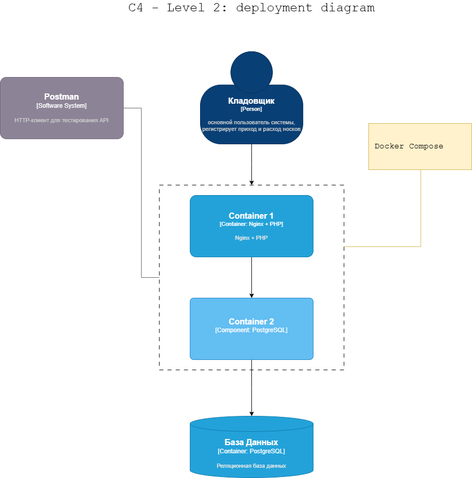

# Система учета носков на складе

API для автоматизации учета носков на складе магазина.

## Архитектура




### Файл [`income.php`](src/api/income.php)
Приход носков на склад
- Обрабатывает POST-запросы на добавление носков
- Валидирует входные данные (название, цвет, состав хлопка, количество)
- Создает новый SKUID или находит существующий
- Записывает операцию прихода в базу данных
- Возвращает JSON с данными о созданной операции

### Файл [`outcome.php`](src/api/outcome.php)
Расход носков со склада
- Обрабатывает POST-запросы на списание носков
- Проверяет наличие достаточного количества носков на складе
- Валидирует возможность списания (нельзя списать больше чем есть)
- Записывает операцию расхода
- Возвращает JSON с данными об операции

### Файл [`socks.php`](src/api/socks.php)
Получение информации о носках

- Обрабатывает GET-запросы с возможностью параметров фильтрации
- Поддерживает параметры фильтрацию по цвету и составу хлопка
- Возвращает информацию об остатках носков на складе

### POST `/api/socks/income`
Регистрирует приход носков на склад.

**Тело запроса (JSON):**
```json
{
  "skuName": "Носки",
  "color": "red",
  "cottonPart": 30,
  "quantity": 15
}
```

### POST `/api/socks/outcome`
Регистрирует отпуск носков со склада.

**Тело запроса (JSON):**
```json
{
  "skuName": "Носки",	
  "color": "red", 
  "cottonPart": 30,
  "quantity": 10
}
```

### GET `/api/socks`
Возвращает остаток  носков на складе с возможностью фильтрации по критериям.

**Параметры фильтрации по критериям**
- `color` - цвет носков (строка)
- `operation` - оператор сравнения (`moreThan`, `lessThan`, `equal`)
- `cottonPart` - процент хлопка (`0-100`)

**Примеры:**
- `/api/socks?color=red&operation=moreThan&cottonPart=90`
- `/api/socks?color=black&operation=lessThan&cottonPart=10`

## Запуск с Docker
Запуск изолированной тестовой среды производится при помощи `docker compose`. Сценарий и параметры запуска указаны в файле [Composefile](Composefile).

## Утилита `make`
Для быстрого запуска предусмотрен сценарий описанный в файле [Makefile](Makefile)
- `compose-up` - запуск контейнеров
- `compose-down` - остановка контейнеров
- `build-image` - сборка образа
	
## API 
По адресу: `http://localhost:53586/` будет доступна среда разработки Visual Studio Code.  
API доступна по `proxy/80/`.

## Коды ответов

- **200** - успешное выполнение
- **400** - некорректные параметры запроса
- **500** - внутренняя ошибка сервера